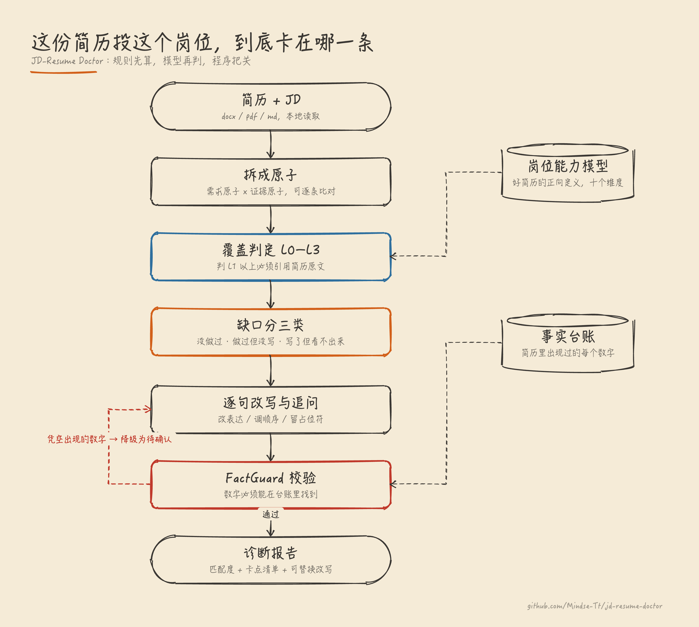

# JD-Resume Doctor

按岗位诊断简历的本地引擎。给它一份简历和一段 JD，它告诉你这一版投这个岗位**卡在哪一条**，
以及卡住的原因是「没做过」「做过但没写」还是「写了但看不出来」——这三件事的解法完全不同。

全本地运行，**不需要任何 API key**，简历不出本机。

```
能力体检 81/100  能独立带一个 AI 产品方向
与 JD 匹配 78/100  可以投

最卡的几件事：
  [做过但没写]     负责 RAG 知识库的知识生产与检索策略设计
  [写了但看不出来]  搭建大模型应用的评测体系，对 badcase 做归因定位
  [没做过]         3年以上 Android 开发经验，精通 Kotlin/Java
```



## 装

```bash
git clone https://github.com/Mindse-Tt/jd-resume-doctor.git
cd jd-resume-doctor
pip3 install pyyaml jieba          # 只有这两个依赖
brew install poppler               # 解析 PDF 用，可选
```

## 用

**网页版**（给求职者，拖文件即可）

```bash
python3 jrd.py web
```

浏览器自动打开，只监听 `127.0.0.1`。

**命令行**（批量跑，或对着多个 JD 比较）

```bash
python3 jrd.py diagnose --resume 简历.docx --jd jd.txt --title "AI产品经理"

# 没有 JD 也能跑：投这类岗普遍要什么、你缺哪几项
python3 jrd.py diagnose --resume 简历.docx --role ai_pm
```

**Claude Code Skill**（要逐句改写时）

把 `skill/` 装进 `~/.claude/skills/resume-doctor/`，然后直接说
「帮我按这个 JD 看看这份简历」。语义层在会话里跑，能中途反问你
「这个 30% 是环比还是同比」——这是网页表单做不到的。

## 它凭什么比「把简历和 JD 丢给大模型」强

### 1. 先有正向标准，再谈问题

`kb/role_profiles/ai_pm.yaml` 定义了「一份好的 AI 产品简历应该证明哪些能力」——
十个维度，每个带权重、正面证据的信号、L1/L2/L3 分级，
以及**一句面试官真会问的话**。

> 想不出面试官会怎么问，这个维度就不该存在。

这条是硬约束，`tests/test_kb.py` 会检查每个维度都有 `probe` 字段。
问题清单是从这个模型推导出的缺口，不是拍脑袋列的负面清单。

| 维度 | 权重 | 面试官会问 |
|---|---|---|
| 评测体系 | 0.14 | 你怎么知道这版比上一版好？评测集多少条、谁标的？ |
| 知识生产与检索策略 | 0.13 | 不同类型的问题，检索方式一样吗？知识库多大？ |
| 场景判断与方案选型 | 0.12 | 为什么选 Workflow 不选 Agent？换成 Prompt 行不行？ |
| Agent 编排与工具边界 | 0.11 | tool 粒度怎么切的？切太细规划会爆炸 |
| badcase 归因 | 0.11 | 你怎么判断是检索的问题还是回复模型的问题？ |
| …… | | 完整十项见 `kb/role_profiles/ai_pm.yaml` |

换岗位就换一个 profile 文件，不用碰代码。

### 2. 需求原子 × 证据原子的覆盖矩阵

JD 拆成 `hard_gate / core_duty / plus / hidden` 四类需求原子，
简历拆成带定位坐标的证据原子，逐条判覆盖等级 L0–L3。

**硬约束：判 L1 以上必须引用简历原文的 bullet id，引用为空一律降为 L0。**
这不是形式主义，是防模型脑补的闸门。

不用余弦相似度——它只能告诉你「像不像」，不能告诉你「哪条要求没被满足」。

### 3. 防编造靠程序，不靠在提示词里写「请不要编造」

解析时建 `FactLedger` 事实台账，记下简历里出现过的每个数字与专有名词。
改写完成后 `core/factguard.py` 逐条校验：

| 态 | 允许 | 不允许 |
|---|---|---|
| A 事实改写 | 换动词、调语序、拆长句 | 引入原句没有的数字、公司、技术名 |
| B 结构重组 | 调顺序 | 改动任何一个字 |
| C 待确认 | 输出 `[[待确认:xxx]]` 占位符 + 一个具体追问 | 用「合理的」数字填上 |

改写句里的每个数字必须能在台账里找到，否则**强制降级为 C 态**并自动生成追问。
`tests/test_factguard.py` 是这条红线的回归测试，必须常绿。

## 实测过的东西

`tests/cases/` 里是专门用来骗模型的对抗案例，每一条都对应一次真实发现的漏洞：

| 案例 | v0.1 | 现在 | 说明 |
|---|---|---|---|
| 真实强简历 | 49.8 | 44 | 基准 |
| **术语堆砌**（塞满行话、零实质） | **48.4** | **22** | v0.1 时几乎等于真人，现已识破并封顶 |
| **有实质无术语**（大白话讲清设计取舍） | **1.1** | 3 + 标记「判不了」 | 规则层召回不到，分数声明不作数 |
| 注水型（全是漂亮数字） | 12.7 | 13 | — |
| 无 AI 内容 | 0 | 0 | — |

第二行是当前版本最大的短板：**规则层靠术语召回证据，抓不到用大白话写的人**。
这种情况页面和 CLI 都会提示分数不作数，需要语义层重判。

## 目录

```
core/                引擎
  ingest.py          docx / pdf / md 解析，建立定位坐标
  structure.py       分节、经历、bullet，同步构建 FactLedger
  rules.py           23 条确定性检测器
  profile.py         对着岗位能力模型体检
  jd.py              JD 拆成四类需求原子
  align.py           BM25 召回 + 覆盖等级 + 证据强度加权
  score.py           评分与卡点定位
  factguard.py       ★ 红线执行点
  report.py          单文件 HTML 报告
kb/                  知识库（纯 YAML，改这里不用碰代码）
  role_profiles/     ★ 岗位能力模型：好简历的正向定义
  issues.yaml        23 条问题规则，每条带「面试官会怎么看」
  hidden_signals.yaml JD 隐藏信号映射
skill/SKILL.md       Claude Code Skill：语义层流程与红线
web/                 本地网页版（零第三方依赖）+ 静态前端构建
tests/               pytest，39 条
```

## 怎么让它变强

**改 `kb/` 就行。** 每带一个人、发现一类新问题，往 `kb/issues.yaml` 加一条；
发现岗位需要新能力维度，往 `kb/role_profiles/` 加一项——
加的时候必须同时写出 `probe`（面试官会怎么问），否则测试不过。

知识库是这个工具唯一的资产，代码只是执行器。

## 已知边界

- **PDF 只读不改**。改中文 PDF 在字体嵌入和行宽回流上必崩，不做假承诺
- 文本框 / 多栏排版的 docx 判为「不可安全编辑」，坦率降级为对照表
- JD 只支持粘贴文本，不抓链接（各招聘平台反爬 + 登录墙）
- **判级仍靠正则召回**，不用行话的简历会被低估——正确的分工是规则层只做召回与排除、
  等级判定交给语义层，这一步还没做
- 能力模型的权重与分档是按少量样本标定的估计值，需要攒够真实回执重标

## 测

```bash
python3 -m pytest tests/ -q
```

## License

MIT
