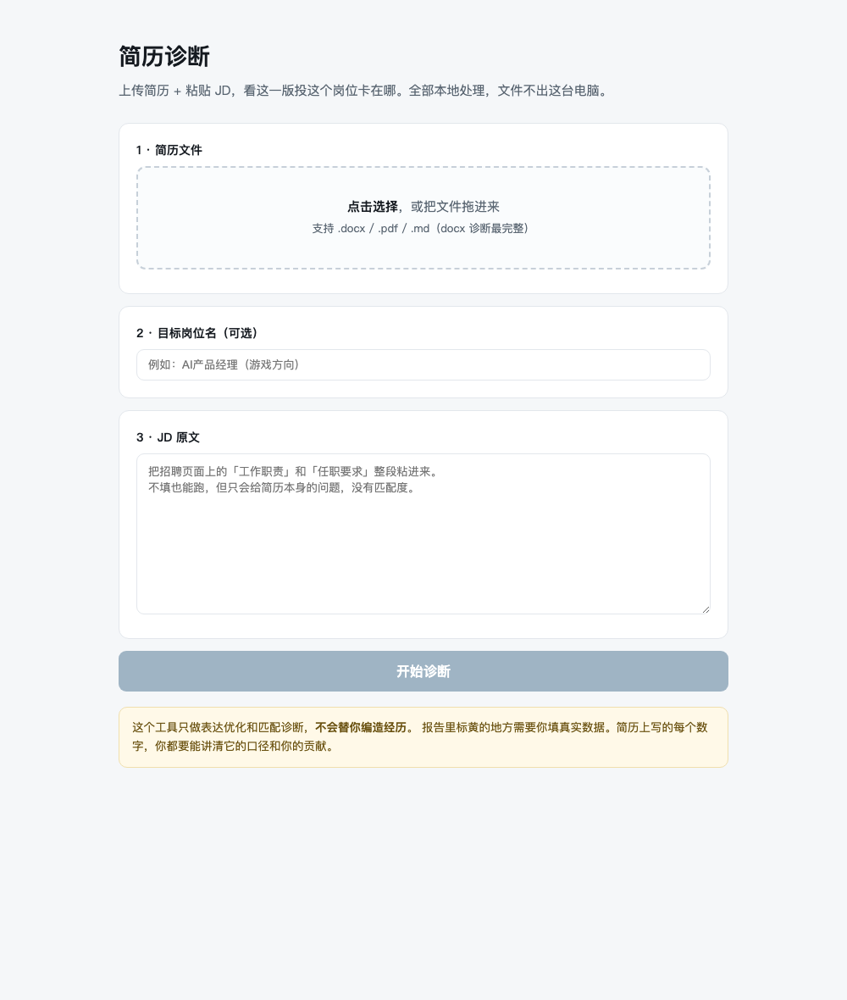
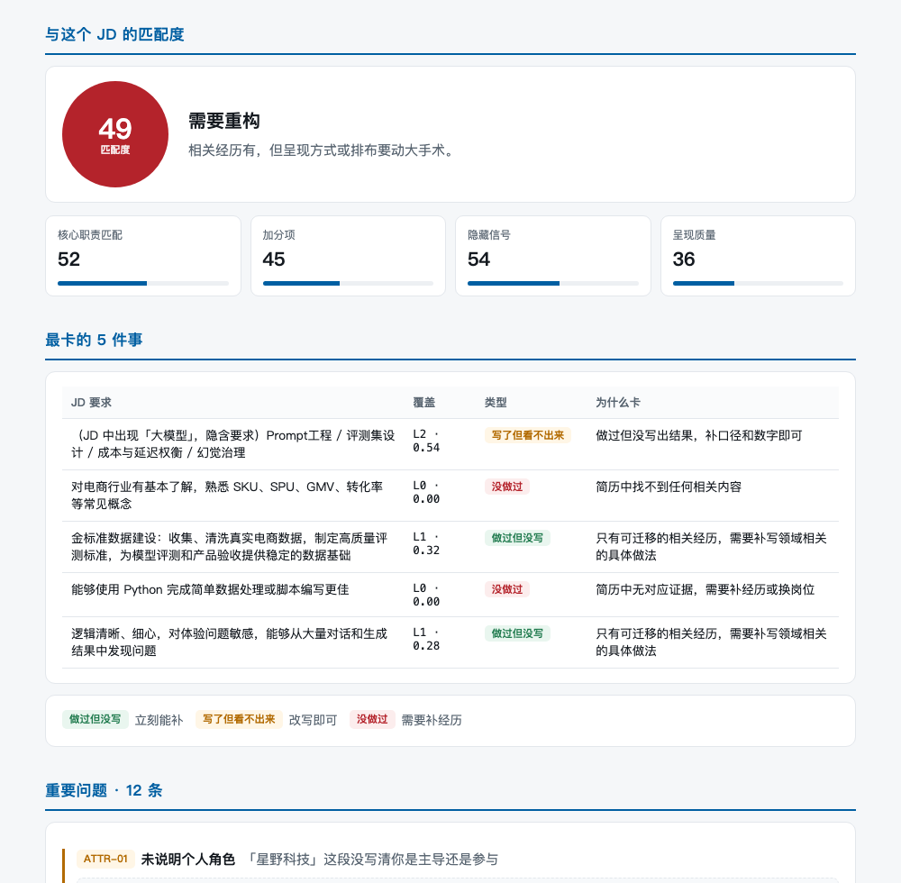
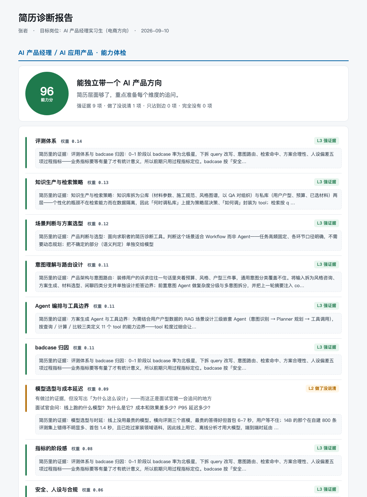

# JD-Resume Doctor

按岗位诊断简历的本地引擎。给它一份简历和一段 JD，它告诉你这一版投这个岗位**卡在哪一条**，
以及卡住的原因是「没做过」「做过但没写」还是「写了但看不出来」——这三件事的解法完全不同，
而市面上的工具混为一谈。

**全本地运行，不需要任何 API key，简历不出本机。** 依赖只有 `pyyaml` 和 `jieba`。

<table>
<tr>
<td width="50%"></td>
<td width="50%"></td>
</tr>
<tr>
<td align="center"><sub>网页版：拖简历、粘 JD、点诊断</sub></td>
<td align="center"><sub>报告：匹配度 + 硬性门槛 + 最卡的 5 件事</sub></td>
</tr>
</table>

> 截图中的简历为脱敏示例（`examples/resume_example.md`），非真实个人信息。

---

## 目录

- [它能做什么](#它能做什么)
- [快速开始](#快速开始)
- [会产出什么文件](#会产出什么文件)
- [三个入口](#三个入口)
- [核心设计](#核心设计)
- [怎么改造成你自己的标准](#怎么改造成你自己的标准)
- [实测过的对抗案例](#实测过的对抗案例)
- [已知边界](#已知边界)

---

## 它能做什么

### 1. 岗位能力体检（不需要 JD）

对着岗位能力模型逐项体检，回答「投这类岗普遍要求什么、你缺哪几项」。
每个维度给出 **L0–L3 判级**、**简历里的原文证据**，以及**一句面试官真会问的话**。



### 2. 与具体 JD 的匹配诊断

JD 拆成「硬性门槛 / 核心职责 / 加分项 / 隐藏信号」四类需求，
逐条判覆盖等级，算出匹配度，并列出**最卡的 5 件事**。

**硬性门槛未体现会单独置顶报警**——这类问题不解决，改别的都白改。

### 3. 把缺口分成三类（最有价值的输出）

| 类型 | 含义 | 该怎么办 |
|---|---|---|
| 🟢 **做过但没写** | JD 要的能力你其实有，简历上一个字没提 | 今晚就能补 |
| 🟠 **写了但看不出来** | 内容在，但埋在从句里、没数字口径、或用了 JD 之外的同义词 | 纯表达问题，改写即可 |
| 🔴 **没做过** | 简历里找不到任何相关证据 | 改简历没用，补经历或换岗位 |

一个人拿到「匹配度 58 分」不知道该干什么；知道哪三条属于哪一类，他今晚就知道动手改哪里。

### 4. 逐句改写 + 追问清单（配合 Claude Code Skill）

对每条问题给出**可直接替换的句子**，并标明三态：

- **A 事实改写**（绿）：只换动词、调语序、拆长句 → 可直接采纳
- **B 结构重组**（蓝）：只调顺序，一个字不改
- **C 待确认**（黄）：缺信息时只输出 `[[待确认:基线]]` 占位符 + 一个具体追问

所有 C 态汇总成**追问清单**，按「回答后能提多少分」排序，最多 8 条。

### 5. 术语堆砌识别

塞满 RAG、Agent、评测体系等行话但零实质的简历会被识破并**封顶**，
报告里直接标「疑似术语堆砌」。反过来，用大白话写、不带行话的简历会提示
**「规则层判不了，分数不作数」**，而不是给一个假的低分。

### 6. 纯前端体检版（可部署给别人用）

```bash
python3 web/build_miaoda.py        # 生成 dist/index.html
```

十个维度的判级、堆砌识别、实质指标全部编译进单个 HTML，
**在浏览器里跑，简历不上传**。可直接托管到任意静态站点。
维度数据从 `kb/role_profiles/*.yaml` 生成，改 YAML 重新 build 即可同步，前后端不会跑偏。

---

## 快速开始

```bash
git clone https://github.com/Mindse-Tt/jd-resume-doctor.git
cd jd-resume-doctor
pip3 install pyyaml jieba          # 全部依赖
brew install poppler               # 可选，解析 PDF 用

# 仓库里带了可直接跑的示例
python3 jrd.py diagnose \
  --resume examples/resume_example.md \
  --jd     examples/jd_example.txt \
  --title  "AI 产品经理实习生（电商方向）"
```

终端会打印摘要，并给出一份 HTML 报告的路径：

```
【AI 产品经理 / AI 应用产品 能力体检】 96 / 100    能独立带一个 AI 产品方向
强证据 9 项 · 只做没说清 1 项 · 沾边 0 项 · 完全没有 0 项

匹配度 60 / 100    改写后可投

最卡的几件事：
  [没做过]        对电商行业有基本了解，熟悉 SKU、SPU、GMV、转化率等常见概念
  [做过但没写]     金标准数据建设：收集清洗真实电商数据，制定高质量评测标准
  [写了但看不出来] （JD 中出现「大模型」，隐含要求）Prompt工程 / 评测集设计 / 成本与延迟权衡
```

**没有 JD 也能跑**，只做能力体检：

```bash
python3 jrd.py diagnose --resume examples/resume_example.md --role ai_pm
```

**`examples/resume_template.md`** 是一份空白模板，里面写了三条硬要求（说清为什么这么设计、
数字要带口径、说清角色边界），照着填就能避开大部分常见问题。

---

## 会产出什么文件

每次运行在 `runs/<时间戳>_<简历名>/` 下产出四个文件：

| 文件 | 是什么 | 给谁看 |
|---|---|---|
| `diagnosis.html` | **单文件 HTML 报告**，内联全部样式、无外链 | 直接微信/飞书转发给本人 |
| `analysis.json` | 完整结构化结果：评分、覆盖矩阵、问题清单、改写建议 | 程序消费 |
| `pack.json` | 精简输入包：事实台账、bullet 列表、需求原子、规则命中 | **喂给语义层（Skill）** |
| `semantic.json` | 语义层回写的改写建议与追问（由 Skill 生成） | 再跑一次即可渲染进报告 |

`runs/` 已在 `.gitignore` 中——里面是真实简历，不会被误提交。

---

## 三个入口

所有诊断逻辑收敛在 `core/`，三个入口只是不同的 I/O 适配器。

### 网页版 —— 给求职者

```bash
python3 jrd.py web          # 浏览器自动打开
```

零第三方依赖（标准库 `http.server`），**只监听 `127.0.0.1`**，文件不出本机。
拖文件进去、粘 JD、点诊断。

### 命令行 —— 给教练 / 批量场景

```bash
python3 jrd.py diagnose --resume 简历.docx --jd jd.txt --title "岗位名" --out runs/张三
```

同一份简历对多个 JD 跑一遍，比较匹配度，决定投哪些。

### Claude Code Skill —— 要逐句改写时

```bash
cp -r skill ~/.claude/skills/resume-doctor
```

然后直接说「帮我按这个 JD 看看这份简历」。
语义层在会话里跑，**能中途反问你「这个 30% 是环比还是同比」**——这是网页表单做不到的，
也是这个工具和"填个表出报告"的根本区别。

流程见 [`skill/SKILL.md`](skill/SKILL.md)：跑引擎 → 看能力体检 → 复核 JD 拆解 →
蕴含判定 → 缺口分三类 → 写改写 → 生成追问 → 回写重出报告。

---

## 核心设计


**能用规则算的，绝不给模型算。** 规则零成本、可单测、同一份简历跑两次结果一样——
这是报告能当交付物的前提。模型不稳定，不能当地基。

### 1. 先有正向标准，再谈问题

`kb/role_profiles/ai_pm.yaml` 定义了「一份好的 AI 产品简历应该证明哪些能力」——
十个维度，每个带权重、正面证据的信号、L1/L2/L3 分级，以及**一句面试官真会问的话**。

> 想不出面试官会怎么问，这个维度就不该存在。

这是硬约束，`tests/test_kb.py` 会检查每个维度都有 `probe` 字段。
问题清单是从这个模型推导出的缺口，不是拍脑袋列的负面清单。

| 维度 | 权重 | 面试官会问 |
|---|---|---|
| 评测体系 | 0.14 | 你怎么知道这版比上一版好？评测集多少条、谁标的？ |
| 知识生产与检索策略 | 0.13 | 不同类型的问题，检索方式一样吗？知识库多大？ |
| 场景判断与方案选型 | 0.12 | 为什么选 Workflow 不选 Agent？换成 Prompt 行不行？ |
| 意图理解与路由设计 | 0.11 | 用户一句话里有两个意图，你怎么处理？ |
| Agent 编排与工具边界 | 0.11 | tool 粒度怎么切的？切太细规划会爆炸 |
| badcase 归因 | 0.11 | 你怎么判断是检索的问题还是回复模型的问题？ |
| 模型选型与成本延迟 | 0.09 | 线上跑什么模型？为什么是它？P95 延迟多少？ |
| 指标的阶段感 | 0.08 | 上线后业务指标动了吗？没动你凭什么说它有价值？ |
| 安全、人设与合规 | 0.06 | 什么情况下该拒答？人设跑偏了怎么发现？ |
| 0-1 落地与协作推动 | 0.05 | 和算法同学意见不一致时，最后怎么定的？ |

**换岗位就换一个 profile 文件，不用碰代码。**

### 2. 需求原子 × 证据原子的覆盖矩阵

JD 拆成 `hard_gate / core_duty / plus / hidden` 四类需求原子，
简历拆成带定位坐标的证据原子，逐条判覆盖等级 L0–L3。

**硬约束：判 L1 以上必须引用简历原文的 bullet id，引用为空一律降为 L0。**
这不是形式主义，是防模型脑补的闸门。

不用余弦相似度——它只能告诉你「像不像」，不能告诉你「哪条要求没被满足」，
更不能作为改简历的依据。

### 3. 防编造靠程序，不靠在提示词里写「请不要编造」

解析时建 `FactLedger` 事实台账，记下简历里出现过的每个数字与专有名词。
改写完成后 `core/factguard.py` 逐条校验：**改写句里的每个数字必须能在台账里找到，
否则强制降级为「待确认」占位符并自动生成追问。**

这是纯程序逻辑，模型绕不过去。`tests/test_factguard.py` 是这条红线的回归测试，必须常绿。

> 工具不替任何人创造经历。简历上写下的每个数字，本人都要能讲清它的口径、基线和自己的贡献。

---

## 怎么改造成你自己的标准

**改 `kb/` 就行，不用碰代码。**

```
kb/
  role_profiles/ai_pm.yaml   岗位能力模型：加维度 / 调权重 / 换岗位
  issues.yaml                23 条问题规则，每条带「面试官会怎么看」+ 选题钩子
  hidden_signals.yaml        JD 隐藏信号映射：「策略产品」隐含要什么
  lexicon.yaml               动词强度三级表 / 大词空词表 / AI 味句式表
```

加新岗位：复制 `ai_pm.yaml` 改成 `strategy_pm.yaml`，然后 `--role strategy_pm`。
加维度时**必须同时写 `probe`**，否则测试不过。

知识库是这个工具唯一的资产，代码只是执行器。

---

## 实测过的对抗案例

`tests/cases/` 里是专门用来骗模型的简历，每一条都对应一次真实发现的漏洞：

| 案例 | v0.1 | 现在 | 说明 |
|---|---|---|---|
| 真实强简历（`examples/resume_example.md`） | — | **96** | 基准：十个维度都有证据且讲了为什么 |
| **消融版**（同一份，只删掉因果论述） | — | **77.5** | 掉 18.5 分，验证「有没有讲为什么」确实在起作用 |
| **术语堆砌**（塞满行话、零实质） | **48.4** | **22** | v0.1 时几乎等于真人；现已识破并封顶 |
| **有实质无术语**（大白话讲清设计取舍） | **1.1** | 2.8 + 标「判不了」 | 规则层召回不到，分数声明不作数 |
| 注水型（全是漂亮数字） | 12.7 | 12.7 | — |
| 无 AI 内容 | 0 | 0 | — |

第二行是当前最大的短板，见下。

```bash
python3 -m pytest tests/ -q     # 39 条
```

---

## 已知边界

- **PDF 只读不改**。改中文 PDF 在字体嵌入和行宽回流上必崩，不做假承诺
- 文本框 / 多栏排版的 docx 判为「不可安全编辑」，坦率降级为对照表
- JD 只支持粘贴文本，不抓链接（各招聘平台反爬 + 登录墙，ROI 太低）
- **判级仍靠正则召回**，不用行话的简历会被低估。正确的分工是：
  规则层只做召回与排除，等级判定交给语义层——**这一步还没做**
- 能力模型的权重与分档是按少量样本标定的估计值，需要攒够真实回执（投了有没有拿到面试）重标

---

## 目录

```
core/                引擎
  ingest.py          docx / pdf / md 解析，建立定位坐标
  structure.py       分节、经历、bullet，同步构建 FactLedger
  rules.py           23 条确定性检测器
  profile.py         对着岗位能力模型体检
  jd.py              JD 拆成四类需求原子
  align.py           BM25 召回 + 覆盖等级 + 证据强度加权
  score.py           评分与卡点定位
  factguard.py       ★ 红线执行点
  report.py          单文件 HTML 报告
kb/                  知识库（纯 YAML）
skill/SKILL.md       Claude Code Skill：语义层流程与红线
web/                 本地网页版 + 纯前端体检版构建
examples/            可直接跑的示例简历、JD、空白模板
tests/               pytest 39 条 + 对抗案例
docs/                架构图与截图
```

## License

MIT
